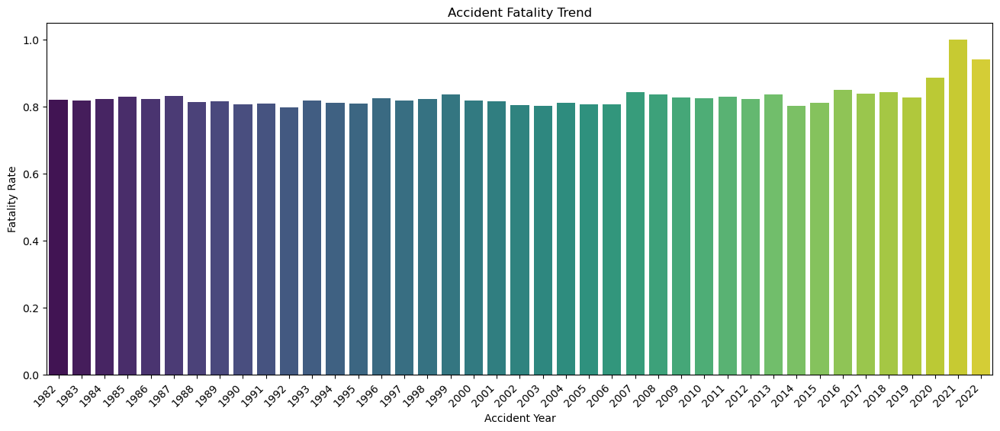

# Aircraft Risk Analysis: Understanding the Risks of an Aircraft Operation Enterprise 

## Project Overview
This project looks at the National Transport and Safety Board's civil aviation accident data from 1962 to 2023 and selected in the United States.

The goal of this analysis is to determine the **safest aircraft** for MyCo to invest in.

## Busines Understanding
MyCo is expanding in order to diversify its business protfolio. MyCo is interested in the aviation industry and in specific the purchasing and operation of airplanes for commercial and private enterprises. 

MyCo has very little understanding about the potential risks of aircrafts and as such an analysis with the aim of determining the aircraft with the lowest risk will be comissioned. The resulting aircraft will be used to start this new business endeavour.

International data was dropped from the analysis for a number of reasons:

1. Compared to the United States data, international accident data had a small sample size i.e. United States (91%) and Others (9%).
2. To ensure consistency in reporting standards as it was noted that international data used differing reporting formats.

## Key Business Question & Stakeholders
The **primary stakeholder** of this analysis and presentation is the Head of the Aviation Division at MyCo. 

With him being the primary stakeholder, a balance of a technical as well as a business approach is appropriate. As such, this analysis will focus on the following business question:

> What is the aircraft with the lowest risk and as such suitable to start the new business endeavour?

We will answer the primary question by answering the following questions:

### Technical Questions
1. Which aircraft models have the lowest accident rates and the fewest fatal injuries? 
2. What are the most common causes of accidents based on the broad phase of the flight? 
    
### Business Questions
1. Which aircraft manufacturers have the best safety records based on accident severity and total injuries?
2. What is the trend of aircraft accidents over time and what does this indicate for future investments?
3. Are amateur-built aircrafts significantly riskier compared to professionally built aircrafts.

## Data Understanding and Analysis
### Data Source
The data in this analysis has been sourced from [NTSB's Aviation Accidents from 1962 to 2023]('https://www.kaggle.com/datasets/khsamaha/aviation-accident-database-synopses/data?select=USState_Codes.csv') which is obtained from Kaggle.

The data contains details on details on aircraft type, weather conditions, accident severity, flight purpose and location.

### Key Features
| Column Name              | Description |
|--------------------------|------------|
| Event.Date            | Date of accident |
| Location            | City or region where the accident occurred |
| Country               | Country of the accident |
| Aircraft.Category     | Type of aircraft (e.g., commercial, private, etc.) |
| Make                  | Aircraft manufacturer (e.g., Boeing, Cessna, Airbus) |
| Model                 | Specific model of the aircraft |
| Number.of.Engines     | Number of engines on the aircraft |
| Engine.Type           | Type of engine (jet, piston, etc.) |
| Injury.Severity       | Severity of injuries (fatal, serious, minor, none) |
| Total.Fatal.Injuries  | Number of fatalities |
| Total.Serious.Injuries| Number of serious injuries |
| Weather.Condition     | Weather at the time of accident (VMC - Visual, IMC - Instrument) |
| Broad.phase.of.flight | Phase of flight when accident occurred (takeoff, cruise, landing, etc.) |
| Air.carrier           | Airline/operator of the aircraft |
| Schedule              | Whether the flight was scheduled or non-scheduled |

### Data Cleaning & Preprocessing
#### Data Preparation
Latitude and Longitude data was removed from the [subset]('notebooks/01_data_exploration.ipynb) as they were deemed not necessary in the analysis. It was perceived that these contained the latitude and longitude of the accident which would bear limited insights in answering the focus questions.
Aircraft carrier data was dropped in the [subsetting section]('notebooks/01_data_exploration.ipynb) since airlines often own and operate airplanes based on similar manufacturers which would make it a redundant column to have in the data frame.

#### Data Cleaning
To ensure data integrity and relevance, the dataset underwent the following preprocessing steps:

1. Column Name Standardization: 
    
    - I renamed all the column names by replacing all the "." that were used as separators to underscores. This was to maintain consistency in formating standards.

2. Duplicate Removal: 

    - I went through the data looking for duplicates that were in the data. It was great to note that there were no duplicates in the data.

3. Timeframe Adjustment: 
    - I changed the 'Event_Date' series to datetime and with this created a new series that hosted the 'Year' of the accidents.
    - When looking at accident distribution by year, I noted that there were very few accidents pre-1982 and as such I decided to drop all rows that were pre-1982.

4. Accident Severity Metric: 
    - I added a new column that would be used to assess accident severity. This column was formed by summing 'Total_Fatal_Injuries', 'Total_Serious_Injuries', 'Total_Minor_Injuries', 'Total_Uninjured' to find the 'People_Onboard'.

5. Engine Type Cleaning:
    - I removed rows where Engine_Type was **UNK** or **Uknown**.

6. 'Injury_Severity' Cleaning:
    - Under Injury_Severity, I removed rows where Injury_Severity was 'Unavailable'
    - I also standardised values to **Fatal** or **Unfatal** by:
        
        1. Replacing **'Minor'** with 'Non-Fatal'
        2. Replacing **'Serious** with 'Fatal'
        3. Converting any value starting with 'Fatal' i.e. 'Fatal(3)' into 'Fatal' 

#### Handling Missing Values
In this section I took the following steps to ensure that I have all the data I need:

1. Removed records where 'Make' and 'Model' fields were missing to maintain aircraft classification accuracy.

2. Dropped entries with unknown or missing weather conditions, as weather is a critical factor in accident analysis.

#### Feature Engineering
1. Location refining:

    - I extracted state abbreviations from the 'Location' series with the aim of merging these with an external dataset containing all the US States and their abbreviations. This would help enhance location-based insights

2. Fatality Rate
    - I created added a series called 'People_Onboard' by summing the series: 'Total_Fatal_Injuries', 'Total_Serious_Injuries', 'Total_Minor_Injuries', 'Total_Uninjured' to find the 'People_Onboard'.
    - I used this to calculate the proportion of injuries that were fatal and mapped this onto another series named 'Fatal_%' which I then used to calculate the severity of the accident.

### Exploratory Data Analysis & Visualisations
#### Accident Counts and Average Fatality Rate

The bar plots look at and compare aircraft makes based on their **average fatality rate** and **total accident count** for manufacturers with at lease 100 recorded accidents.

##### 1. Average Fatality by Make
---

-
In this plot, we see that **Cirrus Design Corp.** has the highest average fatality rate. This means that crashes involving Cirrus aircrafts are more likely to be deadly.

Manufacturers on the left (like **Grumman-Schweizer, Lake and Beech**) have relatively lower fatality rates. Generally meaning that they are safer.

##### 2. Accident Count by Make
---

---
**Piper** and **Cessna** have the highest accident counts by a huge margin. This likely reflects on their high production volumes and widespread use particularly in personal and instructional cases.

#### Engine Type by Fatality
---

---
##### 1. Engine Type vs Accident Fatality
---

---
**Electric and Turbo Jet Engines** have the highest average fatality per accident. This is with the Electric engines leading.
**Reciprocating and Turbo Shaft engines** show the lowest fatality averages, suggesting that accidents involving these engine types are less deadly on average.

##### 2. Engine Type Accident Category
---

---
**Turbo Shaft, Reciprocating and Turbo Fan engines** have a higher proportion of **Non-Fatal** Accidents; these are over 80%. This indicates that they are generally safer in terms of survivability.

#### Amateur vs Professionally built Aircrafts

---
Amateur-built aircrafts have a generally higher fatality rate compared to professionally-built ones.

- The proportion of fatal accidents in anateur-built aircrafts is 26.2% compared to 16.8% for non-amateur. Indicating that crashes involving amateur-built aircrafts are more likely to result in fatalities.

- The increased fatality proportion in amateur-built aircrafts may indicate **structural, design or operational risks** associated with these planes.

- Possible drivers of this observation would be: pilot experience, build quality, maintenance standards or operational conditions.

Non-fatal incidents are the majority in both categories:
- In as much as both have risk associated with them, non-amateur aircrafts have a higher survival rate of 83.2% copmared to 73.8% in its counterpart.

#### Accident Severity Trend

---
There has been a general increase in accident non-fatality i.e. the proportion of non-fatal accidents has increased over time.

In the 1980s and 1990s, non-fatality rates hovered around 80%-82%. By the 2010s and the 2020s, non-fatal accidents climbed above 83%-*4%, even reaching 88.6% in 2020 and 93.9% in 2022.

#### Accident Count Trend

---
There is an overall imporvement in aviation safety over time. This is possibly due to better regulations, improved aircraft technology and enhanced pilot training.

The decrease in accident counts, however, isn't perfectly smooth; some years saw slight increases in accidents. FOr example, in 1995 after a steady drop from 1992 to 1994. Similarly, 2003 and 1005 saw small bumps before continuing the downward trend.

This suggests that aviation safety has improved over time.

## Key Findings
### Industry-Wide Safety Trends

The Aviation Industry has seen significant safety improvements over time, with accident counts decreasing due to advancements in technology, strickter regulations and pobbily even pilot training.

The proportion of non-fatal accidents has increased thus indicating that modern aircrafts are more survivable in crashes. In the 1980s-1990s, non-fatal accident rates were around 80%-82%, but by 2020-2022, they had risen to 88.6% and 93.9% respectively.

### Aircraft Make & Safety

Grumman-Schweizer, Lake, and Beech aircraft have the lowest average fatality rates, making them some of the safest options based on historical accident data.

### Amateur vs. Professionally Built Aircraft
Amateur-built aircrafts have a fatal accident rate of 26.2% compated to a 16.8% for professionally-built aircraft. This could imply, higher structural, design or operational risks in amateur-built aircrafts.

Avoiding amateur-built aircrafts would be the way to go for MyCo.

### Engine Type Considerations

Turbo Shaft, Reciprocating, and Turbo Fan engines are associated with the highest proportion of non-fatal accidents, implying that aircraftd powered by these engines tend to have better survival outcomes.

Electric and Turbo Jet engines have the highest average fatality rates per accident, indicating that crashes involving these engine types are more dangerous.

If MyCo prioritizes passenger safety, it should focus on aircraft with reciprocating or turbo shaft engines for their initial operations.